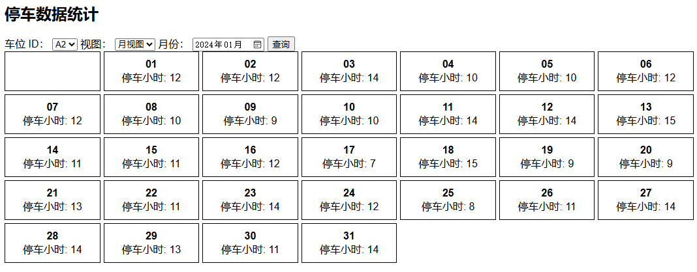

# 🚗 **停车数据统计系统**  

本项目是一个基于 **FastAPI + MongoDB** 的停车数据统计与可视化系统，前端使用 **HTML + JavaScript**，后端提供 API 供前端查询和展示停车数据。  

---

## **📌 功能介绍**
- **数据生成**：使用 `generate_data.py` 生成模拟停车数据存入 MongoDB。
- **后端 API**：
  - `/get_slots/` 获取所有车位 ID
  - `/get_data/` 查询指定车位的停车数据（支持日视图、月视图）
- **前端页面**：
  - **日视图**（Day View）：显示某月每天 24 小时的停车情况（表格形式）
  - **月视图**（Month View）：以日历方式显示每天的停车小时数

---

## **📂 项目结构**
```bash
parking-statistics/
│── backend/                # 后端代码（FastAPI）
│   ├── main.py             # FastAPI 服务器
│── frontend/               # 前端代码（HTML + JS）
│   ├── index.html          # 主页面
│── scripts/                # 脚本
│   ├── generate_data.py    # 生成模拟停车数据
│── README.md               # 项目说明
│── requirements.txt        # Python 依赖
```

---

## **🚀 部署指南（Ubuntu 22.04）**
### **1️⃣ 安装 MongoDB**
```bash
sudo apt update
sudo apt install -y mongodb
```
#### **启动 MongoDB 并设置开机自启**
```bash
sudo systemctl start mongodb
sudo systemctl enable mongodb
```
#### **检查 MongoDB 运行状态**
```bash
sudo systemctl status mongodb
```
如果 MongoDB 运行正常，会显示 `active (running)`。

---

### **2️⃣ 配置 MongoDB 认证（可选）**
如果你的 MongoDB **启用了身份验证**，你需要创建一个管理员用户：
```bash
mongo
```
然后在 MongoDB shell 中执行：
```js
use admin
db.createUser({
  user: "your_username",
  pwd: "your_password",
  roles: [{ role: "root", db: "admin" }]
})
```
**⚠️ 注意**：如果你的 MongoDB **未启用身份验证**，请跳过此步骤。

---

### **3️⃣ 安装 Python 及依赖**
#### **安装 Python 3 和 pip**
```bash
sudo apt install -y python3 python3-pip
```
#### **安装项目依赖**
```bash
pip install -r requirements.txt
```

---

### **4️⃣ 配置后端（MongoDB 连接）**
打开 `backend/main.py`，找到以下代码：
```python
MONGO_USERNAME = "your_username"
MONGO_PASSWORD = "your_password"
MONGO_HOST = "localhost"
MONGO_PORT = 27017
MONGO_DB = "parking_db"

# 连接 MongoDB（包含身份验证）
mongo_uri = f"mongodb://{MONGO_USERNAME}:{MONGO_PASSWORD}@{MONGO_HOST}:{MONGO_PORT}/{MONGO_DB}?authSource=admin"
client = MongoClient(mongo_uri)
```
#### **如果 MongoDB 启用了身份验证**
- **修改 `MONGO_USERNAME` 和 `MONGO_PASSWORD`** 为你的 MongoDB 账户信息。

#### **如果 MongoDB **未启用** 身份验证**
- **删除 `MONGO_USERNAME`、`MONGO_PASSWORD`，并修改 `mongo_uri` 为：**
```python
mongo_uri = f"mongodb://{MONGO_HOST}:{MONGO_PORT}/{MONGO_DB}"
client = MongoClient(mongo_uri)
```

---

### **5️⃣ 运行后端（FastAPI）**
```bash
cd backend
python main.py
```
默认后端运行在 `http://localhost:8000`。

---

### **6️⃣ 生成模拟数据**
```bash
cd scripts
python generate_data.py
```
成功后，MongoDB 中会存入停车数据。

---

### **7️⃣ 运行前端**
直接用浏览器打开 `frontend/index.html`，然后：
1. 选择 **车位 ID**
2. 选择 **视图（日视图 / 月视图）**
3. 选择 **月份**
4. **点击查询**，查看停车数据
5. 前端页面截图：




---

## **📌 API 说明**
| **接口**       | **方法** | **描述** |
|---------------|---------|---------|
| `/get_slots/` | `GET`   | 获取所有车位 ID |
| `/get_data/`  | `GET`   | 查询停车数据（支持日视图、月视图） |

### **示例请求**
```bash
curl "http://localhost:8000/get_data/?slot_id=A1&view=day&year=2024&month=2"
```

---

## **📜 许可证**
本项目基于 **MIT 许可证** 开源，欢迎贡献代码！ 🚀